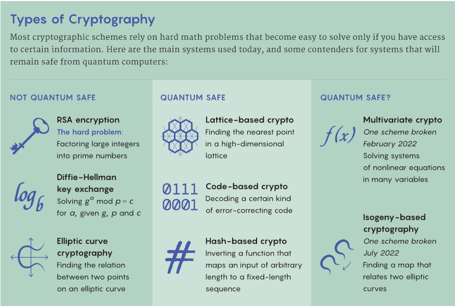

# Post-Quantum Crypto

## ⚛⚠ Known not quantum safe

- RSA
- Diffie-Hellman key exchange
- Elliptic curve cyrpto

## ⚛❔ Not known quantum safe

- Multivariate crypto
  - one scheme broken Feb 2022
- Isogeny-based crypto
  - one scheme broken Jul 2022

## ⚛✅ Known quantum safe

- Lattice-based crypto
- Code-based crypto
- Hash-based crypto

